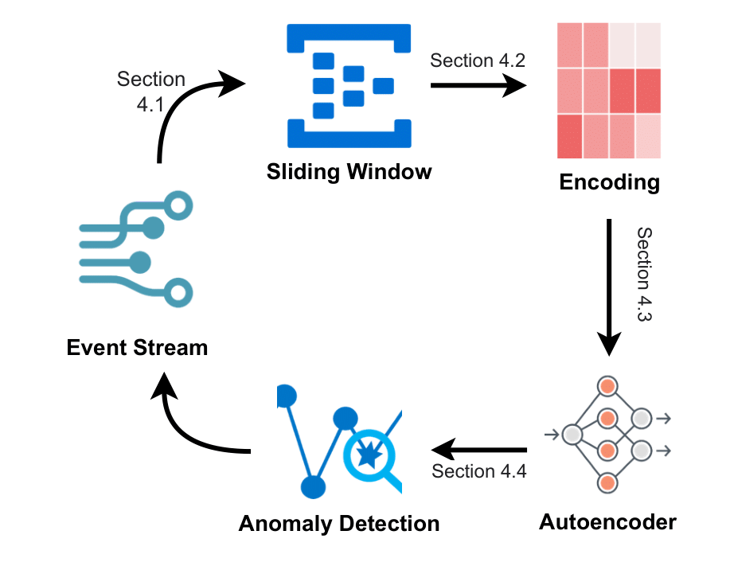

# 1. Unsupervised Anomaly Detection of Prefixes in Event Streams using Online Autoencoders
This repository contains code and resources for performing anomaly detection in event streams using autoencoders with two different encoding methods: 
1. **One-Hot Encoding**: In this approach, each event is represented as a one-hot vector.

2. **Word2Vec Encoding**: This method uses Word2Vec embeddings to represent events and their attributes.

Our framework is visualised below:



## In order to run the code, please follow these steps:

1. Clone the repository
2. Install the requirements (python - 3.9.21)
    ```
    pip install -r requirements.txt
    ```
3. Run the Notebooks for reproducing the results presented in the paper.
